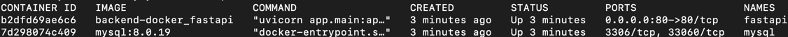

## Instructions:

1. Docker needs to be installed.
2. Cd into the project folder, run command "docker-compose up --build" (or "docker-compose up -d --build" to run without logs shown from terminal).
3. In another terminal, run command "docker ps" to make sure all the containers are up running.

4. Copy the CONTAINER ID of the fastapi service, open another terminal and use the following command to get into the fastapi service container:
"docker exec -it {CONTAINER ID} /bin/bash".
5. In the fastapi service container, cd into the app/ folder and run command "python initial_data.py" to initialize all the tables in DB.
6. Use command "exit" to exit the container.
7. Go to "http://localhost/docs" to check if the server is actually up running and if the apis are working.
The default superuser is (username: admin@rapid.com, password: admin).
